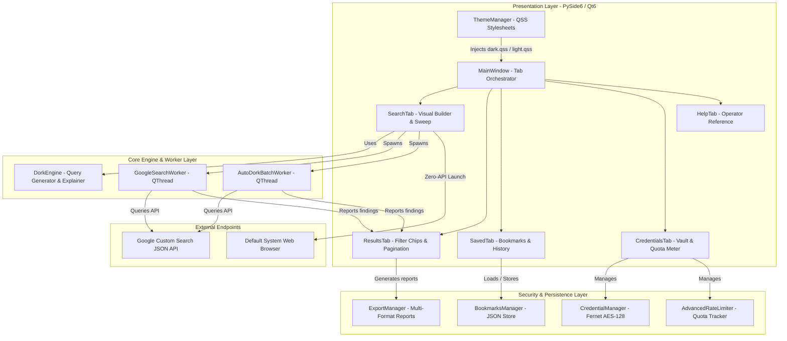
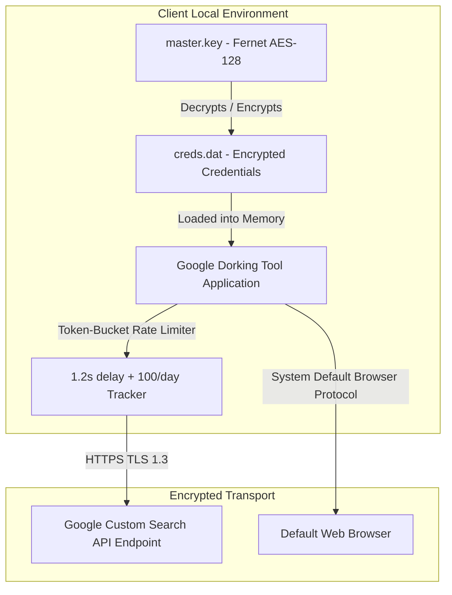

# Google Dorking Tool v1.2 - System Architecture & Technical Specification

```
================================================================================
Application:         Google Dorking Tool v1.2
Framework:           PySide6 (Qt 6.11+) + Qt Designer + QSS Stylesheets
Architecture:        Modular Python MVC / Decoupled Component Architecture
Security:            Fernet AES-128 Credential Encryption + Token-Bucket Throttling
Entity Support:      Domains/Hosts, Email Addresses, Person Names, Usernames/Keywords
License:             GNU Affero General Public License v3.0 (AGPLv3)
================================================================================
```

---

## 1. Executive Summary & Product Scope

**Google Dorking Tool v1.2** is a modular, high-performance Open Source Intelligence (OSINT) and penetration testing desktop application. It bridges the gap between raw Google search operator syntax and real-world cybersecurity reconnaissance workflows.

The application allows security analysts, penetration testers, red teamers, and investigators to:
1. Construct complex search dorks using a **Visual Form Builder** with zero syntax errors.
2. Target diverse entities (**Domains**, **Email Addresses**, **Person Names**, and **Usernames/Keywords**) with specialized query patterns.
3. Understand query mechanics through a real-time **Plain-English Query Explainer** and **Complexity Analyzer**.
4. Execute queries via **Google Custom Search API** (automated in-app search, live tables, pagination, and multi-format reports) or **Direct Browser Mode** (zero-API requirement, zero quota consumption).
5. Safely manage API credentials via **Fernet AES-128 symmetric encryption**.
6. Track daily API usage with a **Token-Bucket Rate Limiter** and UTC midnight auto-reset.
7. Triage findings with **Dynamic Category Filter Chips** and export them to **CSV (Excel UTF-8 BOM)**, **JSON**, **Styled Dark HTML**, **Markdown**, and **Plain Text**.

---

## 2. Inventory: Everything Existing, Upgraded, and Added

### 2.1. Comparison: Legacy Monolithic v1.1 vs Modular v1.2

| Area | Legacy v1.1 Implementation | Upgraded v1.2 Modular Implementation |
| :--- | :--- | :--- |
| **Code Structure** | Single 1,500+ line monolithic script (`GoogleDorkingTool-v1.1.py`). | Decoupled 15-module package (`dork_tool/`) with separated concerns. |
| **GUI Framework** | Legacy PyQt5 with hardcoded styles and UI deprecation warnings. | Official **PySide6 (Qt 6.11+)**, **Qt Designer (.ui)**, and external **QSS**. |
| **Branding & Claims** | "PRO" marketing claims and non-standard version tags. | Clean, standardized **Version 1.2.0** with zero emojis and pro security labels. |
| **Target Scope** | Assumed all targets were web domains (`site:target`). | **Multi-Target Intelligence**: Dedicated Domain, Email, Person, & Username modes. |
| **Dork Construction** | Manual text box typing prone to syntax/spacing errors. | **Visual Dork Form Builder** + Clickable Filetype Extension Pills. |
| **Query Understanding** | None; required manual operator knowledge. | **Real-Time Plain-English Explainer** + Operator / Complexity Inspector. |
| **Dork Templates** | Basic hardcoded list. | **35+ Curated Goal-Based Recipes** across 10 security domains. |
| **Automated Recon** | Fixed category checkboxes without preset profiles. | **14 Categories** + One-click **OSINT Presets** (Domain, Email, Person, Username). |
| **Credential Storage** | Plaintext / basic base64 in user directory. | **Fernet AES-128 Encryption** (`~/.google_dorking_tool/creds.dat`) + Validator. |
| **Rate Limiting** | Primitive `time.sleep` blocking the main thread. | **Advanced Rate Limiter** + Quota Persistence + Non-blocking `QThread` workers. |
| **Results Explorer** | Plain table without category filtering. | **Dynamic Category Filter Chips**, Pagination, High-Contrast Theme Links. |
| **Reporting & Export** | Basic CSV export. | **5 Formats**: CSV (Excel BOM), JSON, Styled Dark HTML, Markdown, Plain Text. |
| **Bookmarks & History** | Simple bookmark list. | Searchable Bookmarks & History with one-click re-runs and quick copy. |
| **Theme Engine** | Hardcoded Dark theme only. | **Dual QSS Themes**: Obsidian Cyber Dark (`dark.qss`) & Clean Light (`light.qss`). |
| **User Experience** | Blocking modal alerts; scroll wheel tab jumping. | Non-switching tabs, smooth scroll areas, keyboard shortcuts, toast status bar. |

---

## 3. High-Level System Architecture



---

## 4. Detailed Component & Module Reference

```
Google-Dorking-Tool-1.1/
├── dork_tool/                         # Core Python Package Root
│   ├── __init__.py                    # Version 1.2.0 package metadata
│   ├── models.py                      # SearchResult dataclass & serialization
│   ├── security.py                    # Fernet AES-128 Credential Manager
│   ├── rate_limiter.py                # Token-bucket throttler & quota tracker
│   ├── engine.py                      # Multi-target query generator & explainer
│   ├── workers.py                     # Non-blocking PySide6 background threads
│   ├── bookmarks.py                   # Bookmarks and execution history manager
│   ├── exporter.py                    # Multi-format report generation engine
│   └── ui/                            # User Interface Layer
│       ├── __init__.py                # UI exports
│       ├── loader.py                  # ThemeManager & QUiLoader helper
│       ├── main_window.py             # Primary Application Window & shortcut hub
│       ├── search_tab.py              # Visual Builder, Recipes & Auto Sweep tab
│       ├── results_tab.py             # Results Explorer, Chips, Table & Pagination
│       ├── saved_tab.py               # Bookmarks & History split view
│       ├── creds_tab.py               # API Credentials vault & Quota gauge
│       ├── help_tab.py                # Operator Reference & Methodology guide
│       ├── styles/                    # QSS Stylesheets
│       │   ├── dark.qss               # Cyber Dark Obsidian Theme
│       │   └── light.qss              # Professional Light Theme
│       └── designer/
│           └── main_window.ui         # Qt Designer XML interface layout
├── GoogleDorkingTool-v1.2.py           # Primary application launcher
├── GoogleDorkingTool-v1.1.py           # Backward compatibility alias
├── main.py                            # Standard package entrypoint
├── source code.py                     # Entrypoint mirror
├── requirements.txt                   # Dependency definitions
├── run.bat                            # Windows double-click launcher
├── install_requirements.bat           # Windows dependency installer
├── README.md                          # Repository documentation
└── DOCUMENTATION.md                   # This System Architecture Document
```

---

### 4.1. Core Engine Modules (`dork_tool/`)

#### 1. `dork_tool/models.py`
- **`SearchResult` Dataclass**:
  - `title: str`: Page title returned by Google.
  - `link: str`: Target URL.
  - `snippet: str`: Text snippet / snippet preview.
  - `category: str`: Finding category (e.g. `Login Pages`, `Credentials & Keys`).
  - `query: str`: Originating search query.
  - `timestamp: str`: Discovery timestamp formatted as `%Y-%m-%d %H:%M:%S`.
  - Methods: `to_dict() -> Dict[str, Any]` and `from_dict(data: Dict[str, Any]) -> SearchResult`.

#### 2. `dork_tool/security.py`
- **`CredentialManager`**:
  - Implements symmetric 128-bit AES encryption via Python `cryptography.fernet.Fernet`.
  - Master key is persisted to `~/.google_dorking_tool/master.key` (with POSIX `0o600` permissions when supported).
  - Encrypted payload stored in `~/.google_dorking_tool/creds.dat`.
  - Graceful fallback: If cryptography is unavailable, utilizes standard base64 encoding.
  - Environment variable precedence: Reads `GOOGLE_API_KEY` and `GOOGLE_CSE_ID` if present in OS environment.
  - `validate(api_key, cse_id) -> Tuple[bool, str]`: Tests credentials against `https://www.googleapis.com/customsearch/v1` with HTTP 200/400/403 diagnostics.

#### 3. `dork_tool/rate_limiter.py`
- **`AdvancedRateLimiter`**:
  - `min_interval: float = 1.2s`: Token-bucket delay enforcing minimum duration between outgoing HTTP requests.
  - `daily_limit: int = 100`: Default free-tier quota ceiling.
  - State persistence: Saved to `~/.google_dorking_tool/quota.json`.
  - Auto-rollover: Computes UTC date (`datetime.now(timezone.utc).strftime("%Y-%m-%d")`) on every request, resetting counts at midnight UTC.
  - Methods: `can_request()`, `throttle()`, `record_request()`, `get_stats()`, `reset()`.

#### 4. `dork_tool/engine.py`
- **`DorkEngine`**:
  - **Entity Type Detection (`detect_target_type`)**:
    - `EMAIL`: Contains `@` with valid domain suffix.
    - `DOMAIN`: Starts with `http://`/`https://` or matches `domain.tld`.
    - `PERSON`: Contains whitespace representing multiple name tokens.
    - `KEYWORD`: Single token or username identifier.
  - **Query Generator (`generate_dorks`)**:
    - Synthesizes clean queries tailored to target entity across 14 security categories.
  - **Plain-English Query Explainer (`explain_query`)**:
    - Deconstructs operators (`site:`, `intitle:`, `inurl:`, `intext:`, `filetype:`, `ext:`, `" "`, `-`) into natural language sentences.
  - **Real-Time Query Analyzer (`analyze_query`)**:
    - Calculates character count, word count, detected operators list, target site scope, plain-English explanation, and complexity badge (`Simple`, `Moderate`, `Advanced`).
  - **Catalog of 20+ Operators**: Cataloged in `OPERATORS` dictionary.
  - **35+ Curated Goal Recipes**: Cataloged in `TEMPLATES` across 10 categories.

#### 5. `dork_tool/workers.py`
- **`GoogleSearchWorker(QThread)`**:
  - Single-query execution worker.
  - Emits: `progress_update(int, str)`, `result_ready(List[SearchResult], int, str)`, `error_occurred(str)`, `finished_search()`.
  - Uses `try...finally:` block to guarantee cleanup signals even if exceptions or cancellations occur.
- **`AutoDorkBatchWorker(QThread)`**:
  - Batch sweep worker across multiple dorks.
  - Emits: `progress_update(int, str)`, `results_updated(List[SearchResult])`, `error_occurred(str)`, `batch_finished(List[SearchResult])`.
  - Throttles requests via `rate_limiter.throttle()` and records quota on successful API hits.

#### 6. `dork_tool/bookmarks.py`
- **`BookmarksManager`**:
  - Manages saved dork queries in `~/.google_dorking_tool/bookmarks.json`.
  - Manages execution history in `~/.google_dorking_tool/history.json` (capped at 200 recent entries).
  - Seeded with default security bookmarks on first run.

#### 7. `dork_tool/exporter.py`
- **`ExportManager`**:
  - `export_csv`: Exports to CSV with UTF-8 BOM (`utf-8-sig`) for native Microsoft Excel compatibility.
  - `export_json`: Exports structured JSON payload with ISO timestamps and total counts.
  - `export_html`: Generates standalone dark-themed responsive HTML executive report with XSS-sanitized cards.
  - `export_markdown`: Generates GitHub-flavored Markdown table.
  - `export_txt`: Generates plain-text dossier for terminal review.

---

### 4.2. User Interface Modules (`dork_tool/ui/`)

#### 1. `dork_tool/ui/main_window.py`
- **`MainWindow(QMainWindow)`**:
  - Multi-tab orchestration container housing Search, Results, Saved, Credentials, and Help tabs.
  - **`NonSwitchingTabWidget`**: Subclassed `QTabWidget` with an event filter on `tabBar()` intercepting `QEvent.Wheel` to eliminate accidental tab cycling on trackpad swipe.
  - **Global Keyboard Shortcuts**:
    - `Ctrl+1` – `Ctrl+5`: Direct tab switching.
    - `Ctrl+L`: Toggle Dark/Light QSS Theme.
    - `Ctrl+F`: Focus current tab's primary search/filter input.
    - `F5`: Refresh active data.
    - `Ctrl+Enter` (in query editor): Instant search execution.
  - **Non-Blocking Toast System (`show_toast`)**:
    - Displays feedback in the status bar with auto-clearing timers.

#### 2. `dork_tool/ui/search_tab.py`
- **`SearchTab(QWidget)`**:
  - **Recon Mode Switcher**:
    - `Visual Dork Builder`: Form fields (In Title, In URL, In Body, Exact Phrase, Exclude) + Filetype Pills (`PDF`, `DOCX`, `XLSX`, `SQL`, `ENV`, `LOG`, `BAK`, `CONF`, `YML`, `JSON`) that compile automatically into dork queries.
    - `Curated Goal Recipes`: Filter-as-you-type recipe selector with 35+ dorks and operator buttons.
    - `Automated Target Sweep`: Target domain/entity input, 14 categories with one-click OSINT presets (`Domain Recon`, `Email OSINT`, `Person OSINT`, `Username OSINT`), and dork preview modal.
  - **Live Query Inspector & Explainer**:
    - Interactive `QueryEditor` (`Ctrl+Enter` submit).
    - Plain-English natural language translation card.
    - Real-time character counter, word counter, complexity badge, and detected operators.
  - **Dual Search Actions**:
    - "Search via API (In-App)"
    - "Open in Browser (Direct Zero-API Mode)"

#### 3. `dork_tool/ui/results_tab.py`
- **`ResultsTab(QWidget)`**:
  - **Dynamic Category Filter Chips**: Computes result counts per category in real time and renders interactive pill buttons (`All (15)`, `Login Pages (4)`, `Credentials (3)`).
  - **Live Finding Filter**: Instant text search across Titles, URLs, Snippets, and Categories.
  - **Sortable Findings Table**: Responsive columns with theme-adaptive high-contrast link colors (`#58a6ff` dark, `#0969da` light).
  - **Pagination Controls**: Configurable page sizes (10, 25, 50, 100 per page).
  - **Context Menu (`QMenu.exec`)**: Open in browser, Copy URL, Copy Title, Copy Snippet, Copy Row as JSON.
  - **Report Exporter Toolbar**: Multi-format export trigger.

#### 4. `dork_tool/ui/saved_tab.py`
- **`SavedTab(QWidget)`**:
  - Split view containing **Saved Dork Bookmarks** and **Search Execution History**.
  - Live search filters for both tables.
  - One-click actions: Send to Search Tab, Copy Query, Open in Browser, Re-run Query, Add Custom Bookmark, Clear History.

#### 5. `dork_tool/ui/creds_tab.py`
- **`CredentialsTab(QWidget)`**:
  - Form layout for Google API Key and CSE ID with password visibility toggle.
  - "Save Credentials (AES-128 Encrypted)" action.
  - Real-time "Test API Connection" validation tool.
  - Daily API Quota Gauge with visual progress bar and manual counter reset.
  - Step-by-step Google Cloud & Programmable Search Engine setup guide.

#### 6. `dork_tool/ui/help_tab.py`
- **`HelpTab(QWidget)`**:
  - 20+ Google search operators reference table with descriptions and syntax examples.
  - Ethical reconnaissance methodology guidelines and legal disclaimers.

#### 7. `dork_tool/ui/styles/` (`dark.qss` and `light.qss`)
- **Cyber Dark Obsidian Theme**: `#0d1117` background, `#161b22` cards, `#30363d` borders, `#58a6ff` primary accents, `#238636` success buttons, `#da3633` danger buttons.
- **Professional Light Theme**: `#f6f8fa` background, `#ffffff` cards, `#d0d7de` borders, `#0969da` primary accents, `#1f883d` success buttons.

---

## 5. Security & Threat Modeling



### Security Measures Implemented:
1. **At-Rest Encryption**: API keys and Search Engine IDs are never stored in plaintext on disk. They are encrypted using Fernet AES-128 in `~/.google_dorking_tool/creds.dat`.
2. **Memory Protection**: Decrypted credentials exist in memory only during runtime and are never logged or exported.
3. **HTML XSS Sanitization**: In `ExportManager.export_html()`, all result titles, URLs, snippets, categories, and queries are strictly escaped using `html.escape()` to prevent HTML injection attacks from crawled search result snippets.
4. **CSV Formula Injection Prevention**: Clean CSV serialization with quotes prevents Excel formula execution vulnerabilities (`=`, `+`, `-`, `@`).
5. **Anti-Scraping & Quota Protection**: Token-bucket throttling prevents aggressive API bursts that trigger HTTP 429 rate limit locks or IP reputation degradation.

---

## 6. Verification, Testing & Quality Assurance

The codebase includes an automated test suite located at `scratch/test_modular_pyside6.py`:

```powershell
# Run the complete test suite
.\.venv\Scripts\python.exe scratch\test_modular_pyside6.py
```

### Test Coverage Summary:
- **Zero Emojis Verification**: Regex scans all categories, templates, and labels to confirm zero Unicode emoji characters.
- **Multi-Target Detection & Generation**: Validates domain sanitization, email formatting, person name quoting, and username search patterns.
- **Visual Form Builder Compilation**: Validates form-to-query compilation across all input permutations.
- **Plain-English Explainer**: Asserts accurate natural language translations for complex dorks.
- **QSS Stylesheet Integrity**: Confirms both `dark.qss` and `light.qss` parse without syntax errors.
- **5-Format Exporters**: Generates and verifies CSV, JSON, HTML, Markdown, and TXT outputs.
- **PySide6 Headless Initialization**: Instantiates `MainWindow` and all child tab widgets in offscreen mode to ensure zero startup crashes or deprecation warnings.

---

## 7. Execution & Launch Instructions

### Method 1: Windows Batch Launcher (Recommended)
- Double-click **`run.bat`** in the project directory.

### Method 2: Python / PowerShell
```powershell
cd c:\Users\parve\OneDrive\Desktop\github\dork\Google-Dorking-Tool-1.1

# Install requirements
.\.venv\Scripts\python.exe -m pip install -r requirements.txt

# Launch application
.\.venv\Scripts\python.exe GoogleDorkingTool-v1.2.py
```

---

## 8. License & Attribution
- **License**: GNU Affero General Public License v3.0 ([AGPLv3](./LICENSE)).
- **Intended Use**: Authorized security assessments, penetration testing, OSINT investigation, and cybersecurity education.
